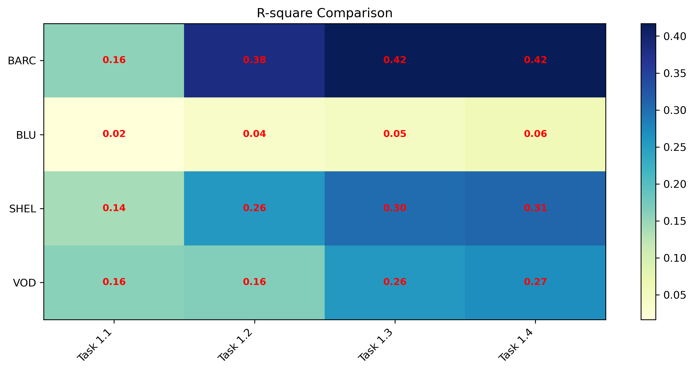
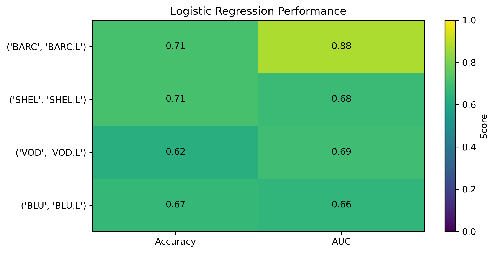

# Fama-French Multi Asset Analysis

## Overview

This project applies the Fama-French Three-Factor Model to a portfolio of UK-listed equities.

The objective is to evaluate whether market, size, and value factors explain portfolio returns and to identify the dominant sources of performance.

---

## Assets Included

- Barclays (BARC.L)
- Shell (SHEL.L)
- Vodafone (VOD.L)
- Bluebird Mining Ventures (BLU.L)

---

## Methodology

1. Download historical price data using yFinance
2. Calculate monthly returns
3. Construct equal-weight portfolio
4. Obtain Fama-French factors
5. Run OLS regression
6. Analyse factor exposure and explanatory power

---

## Tools

- Python
- Pandas
- NumPy
- Statsmodels
- Matplotlib
- yFinance

---

## Key Findings

- Market factor explains the majority of portfolio returns.
- Size and Value factors contribute differently across sectors.
- R-squared analysis suggests that factor models explain a significant portion of return variation.

---

## Research Skills Demonstrated

- Financial Data Analysis
- Quantitative Research
- Regression Modelling
- Factor Investing
- Portfolio Analytics

---

## Correlation Heatmap

---

## Regression Result

---

## Research Conclusion

The Fama-French Three-Factor Model explains a meaningful proportion of return variation across the selected UK equities.

Among the three factors, market risk (MKT-RF) exhibits the strongest explanatory power, while SMB and HML vary across industries. Financial and energy companies demonstrate different factor sensitivities, highlighting the importance of sector characteristics in portfolio construction.

This project demonstrates the application of quantitative factor investing techniques using Python and regression analysis to evaluate equity portfolios.

---
## Author

AC HSUEH

MSc Finance | CFA Level I Candidate

London, United Kingdom# Fama-French Multi Asset Analysis

This project applies the Fama-French Three Factor Model
to a portfolio of UK listed equities.

Assets analysed:

- Barclays (BARC)
- Shell (SHEL)
- Vodafone (VOD)
- BAE Systems (BA)

Methods:

- Linear Regression
- Logistic Regression
- Factor Attribution
- ROC Analysis
- Confusion Matrix
- R² Comparison

Tools:

- Python
- Pandas
- Scikit-Learn
- Statsmodels
- Matplotlib
